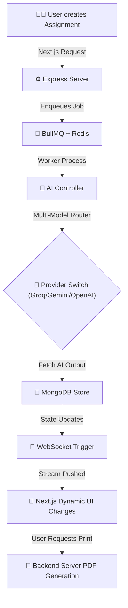

# 🌌 Veda - AI-Powered EdTech workspace

[](https://nextjs.org/)
[](https://tailwindcss.com/)
[](https://expressjs.com/)
[](https://mongodb.com/)

**Veda** is a cutting-edge, AI-powered educational workspace built to automate manual coursework creation for students and educators. It leverages a **scalable multi-model architecture** incorporating **Google Gemini**, **OpenAI**, and **Groq** via a dynamically routed pipeline. To guarantee stability during high loads, it employs a `BullMQ` + `Redis` worker queue system to safely manage generation workloads and API throughput limits without locking the UI.

---

## 🚀 Scalable Multi-Model Architecture & Switching
Veda is engineered to be AI provider-agnostic. 
- **Current Capability**: The backend dynamically routes generation requests based on the `AI_PROVIDER` environment variable (supporting Groq, Gemini, and OpenAI endpoints natively). 
- **Coming Soon (UI Model Switching)**: Development is actively underway to allow users to directly integrate their own API keys via the **Settings -> AI Tab**. This will enable on-the-fly model switching, eliminating hard usage limits and providing granular control over performance vs. cost trade-offs directly from the client interface.

---

## 🛠️ Tech Stack Node Tree

| Component | Technology | Description |
| :--- | :--- | :--- |
| **Frontend** | `React 19` + `Next.js 16` | App router, Tailwind CSS v4, Lucide Icons, modern client-side data fetching |
| **Backend** | `Node.js` + `Express` | Modular routes handler and RESTful endpoints implementation |
| **AI Integrations** | `Google Gen AI` / `OpenAI` / `Groq` | Multi-model pipeline for context-rich educational generations |
| **Worker Queue** | `BullMQ` + `ioredis` | Handles heavy AI generation schemas securely to avoid API crashes |
| **Realtime Updates**| `Socket.io` | Streams active job completion tracking to the Frontend |
| **Database** | `Mongoose (MongoDB)` | Structured query components and active document storage |
| **PDF Engine** | Server / Client Sync | A4 strictly-formatted backend PDF integration eliminating viewport sizing errors |

---

## 🔄 Core Execution Flow

The workspace utilizes an asynchronous generation pipeline to maintain maximum UI responsiveness, offloading heavy token transactions to background workers.



---

## ⚙️ Environment Configuration

Properly define your environment variables to match the active integrations modeled in the codebase.

### **Server Environment (`server/.env`)**
Create a `.env` file in the `server/` root to set your active models and ports:

```env
# Core Node Configuration
PORT=8000
MONGODB_URI=mongodb+srv://<user>:<password>@cluster/
REDIS_HOST=localhost
REDIS_PORT=6379

# Model Switching Architecture Selector (Important)
AI_PROVIDER=groq # Switch between 'groq', 'gemini', or 'openai' here

# Groq Config (Current default fallback)
GROQ_API_KEY=your_groq_api_key_here
GROQ_API_URL=https://api.groq.com/openai/v1/chat/completions
GROQ_MODEL=llama-3.3-70b-versatile
GROQ_MAX_TOKENS=2048

# Gemini Config
GEMINI_API_KEY=your_gemini_api_key_here
GEMINI_MODEL=gemini-2.0-flash

# OpenAI Config
OPENAI_API_KEY=your_openai_api_key_here
OPENAI_MODEL=gpt-4o-mini
OPENAI_MAX_TOKENS=2048
```

### **Client Environment (`client/.env` - Optional)**
By default, the client handles API requests locally at `http://localhost:8000/api`. If deploying your app remotely, override this via Next.js envs:
```env
NEXT_PUBLIC_API_URL=https://your-production-url.com/api
```

---

## 🚀 Setup & Workspace Guide

### 📂 Step 1: Clone and Prepare
Ensure you have `Node.js` installed and a local instance of **Redis Server** actively running. 
*(Note: If you do not run Redis, BullMQ will fail to connect and assignments will freeze at pending).*

### ⚙️ Step 2: Configure The Server Backend
```bash
# Navigate to Server Folder
cd server

# Install Node Dependencies
npm install

# Setup env (Review the env definitions section above)
cp .env.example .env

# Run Server in Dev Mode
npm run dev
```
By default, backend listener triggers initialize on **`http://localhost:8000`**.

### 🖥️ Step 3: Start Frontend Client App
```bash
# Navigate back to Client Folder
cd ../client

# Install React Dependencies
npm install

# Start Frontend Next.js Router
npm run dev
```
The Frontend client executes dynamic dashboards on **`http://localhost:3000`**.

---

## 🌟 Visual & Architecture Highlights
- **Dynamic Multi-Model Support**: Rapidly pivot your LLM provider via standard `.env` updates, without having to rewrite any underlying prompt constraints.
- **Worker & Socket Offloading**: Real-time progress updates stream safely, rendering dynamic loading toasts UI states smoothly until a complete payload resolves. 
- **Backend-Driven PDF Exports**: Bypasses faulty window-scaling logic by executing structured layout parameters directly within the network layer prior to client delivery. 
- **Immersive UX**: Integrated sound effect triggers and dynamic, self-cleansing toast popups keep user feedback perfectly in sync with backend transactions.
