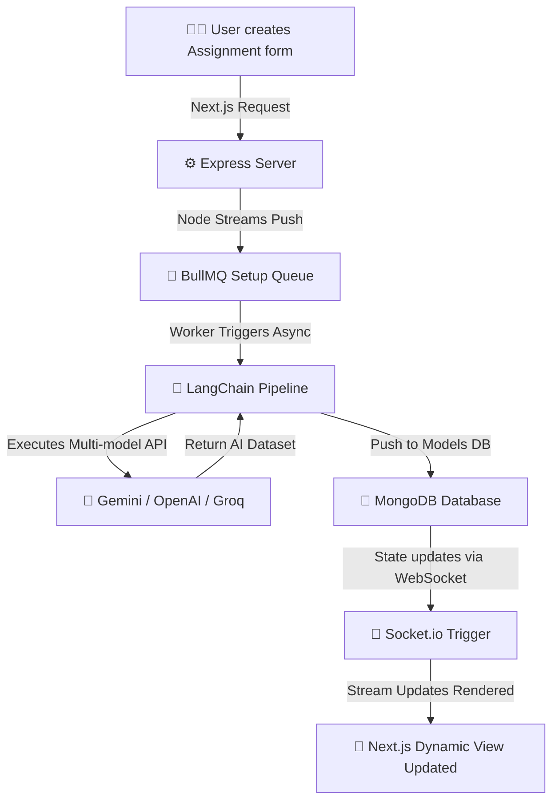

# 🌌 Veda - AI-Powered EdTech workspace

[](https://nextjs.org/)
[](https://tailwindcss.com/)
[](https://expressjs.com/)
[](https://js.langchain.com/)

**Veda** ek cutting-edge, AI-powered educational platform hai jo manual coursework automate karne ke liye banaya gaya hai. Ye AI dynamic modeling se support leta hai like **Google Gemini**, **OpenAI**, and **Groq**, full standard workflow concurrency buffers ko safe aur rapid nodes provide karne ke liye `BullMQ` + `Redis` stack implementation deploy karta hai.

---

## 🛠️ Tech Stack Node Tree

| Component | Technology | Description |
| :--- | :--- | :--- |
| **Frontend** | `React 19` + `Next.js 16` | Dynamic App routing with optimal SSR & layout patterns |
| **Styles** | `Tailwind CSS v4` | PostCSS modularity structured styling system |
| **Backend** | `Node.js` + `Express` | Modular routes handler and WebSockets implementation |
| **AI Integrations** | `LangChain` + `Google Gen AI` | Fallback modules for Gemini, OpenAI & Groq |
| **Worker Queue** | `BullMQ` + `ioredis` | Handles complex AI generations safely to avoid API constraints |
| **Realtime Updates**| `Socket.io` | Streams job backoff tracking triggers to Frontend |
| **Database** | `Mongoose (MongoDB)` | Structured query schemas logic storage |

---

## 🏗️ Directory Roadmap Overview

Veda utilizes a safe, modular monorepo-friendly folder split for **Client** node architecture and **Server** background daemon handlers.

```text
Veda/
├── client/                     # Next.js App Router Structure
│   ├── src/
│   │   ├── app/                # Route Handlers
│   │   │   ├── ai-toolkit/      # Automated AI tools
│   │   │   ├── assignments/     # Generation forms & viewers
│   │   │   ├── groups/          # Classroom/Circles space
│   │   │   ├── library/         # Resources bank manager
│   │   │   ├── profile/         # Settings and preference views
│   │   ├── components/         # Reusable dynamic React widgets
│   │   ├── services/           # Axios handlers and sockets links
│   └── package.json            
│
└── server/                     # Node.js Full Queue Backend Subnet
    ├── src/
    │   ├── db/                 # Connect handles node nodes
    │   ├── middlewares/        # Express request validation limits
    │   ├── routes/             # Static assignment nodes
    │   ├── services/           # BullMQ implementations & rate-throttling
    │   ├── socket.ts           # Streaming WebSocket endpoints trigger
    │   └── index.ts            # Main bootstrap Node listener
    └── .env.example            # Backend AI provider fallback config
```

---

## 🔄 Core Execution Flow

The workspace utilizes an async generation pipeline to maintain maximum responsiveness without locking standard UI threads on high response tokens thresholds.



---

## 🚀 Setup & Setup Workspace Node Guide

### 📂 Step 1: Clone the Setup & Split Windows
First, enter the master scope location and open two split screen tabs or terminals.

### ⚙️ Step 2: Configure The Server Node Backend
```bash
# Navigate to Server Subnet
cd server

# Update local dependencies nodes
npm install

# Setup local environment files variables
cp .env.example .env
```
👉 Open the file `.env` inside `server/` and fulfill the **`GEMINI_API_KEY`** prompt provider fallback requirements. Ensure you have your `Redis` listener locally live.

To start the Server instance:
```bash
# Run nodemon dynamic builder pipeline 
npm run dev
```
By default, listeners trigger standard setup updates on **`http://localhost:8000`**.

---

### 🖥️ Step 3: Start Node Client Router
```bash
# Navigate to Client UI Node
cd ../client

# Full dependencies build trigger nodes
npm install
```
Start Frontend Next.js Subnet:
```bash
# Exec client node router listeners
npm run dev
```
Client standard builds execute live dashboards on **`http://localhost:3000`**.

---

## 🌟 Visual Core Elements Details
- **Dynamic Worker Schedule Filters**: Handles `ASSIGNMENT_QUEUE_CONCURRENCY` setups cleanly out-of-core memory safe.
- **Micro Buffers Limits Tracker endpoints**: Strict rate caps standard thresholds dynamically using `.env` throttlers like `GEMINI_RPM`.
- **Export Formats support**: Utilizes setup triggers triggers handles `html2canvas` safe export downloads nodes layouts setup.
